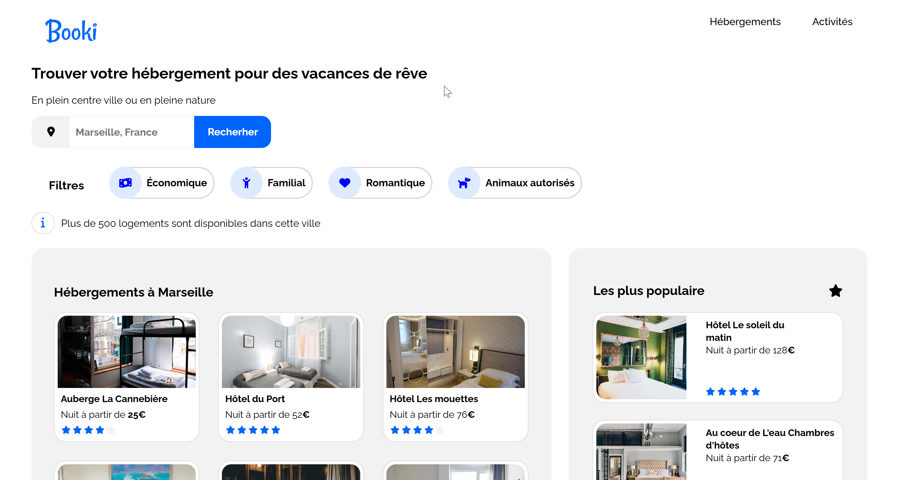

### Booki

  

---

### 📑 Table des matières

* [Mission](#mission)
* [Objectifs](#objectifs)
* [Points forts de l’interface](#points-forts-interface)
* [Stacks techniques](#stacks-techniques)
* [Fonctionnalités et bonnes pratiques](#fonctionnalites-pratiques)
* [Aspects techniques & automatisation](#aspects-techniques-automatisation)
* [Points techniques spécifiques](#points-techniques-specifiques)
* [Démo live](#demo-live)

---

### 🎯 Mission

Développer le site **Booki**, une plateforme permettant aux usagers de **trouver des hébergements et des activités dans la ville de leur choix**.
Le projet consiste à transformer une **maquette fournie par l’UI designer** en un site web **responsive** et conforme aux standards du **W3C**.

---

### 🧭 Objectifs

* Intégrer une interface moderne avec **HTML5 & CSS3**
* Respecter la **charte graphique** et l’accessibilité
* Mettre en place un design **desktop-first** puis adapté tablette et mobile
* Assurer une compatibilité avec les navigateurs récents (Chrome, Firefox)

---

### ✨ Points forts de l’interface

* Barre de navigation avec liens ancrés (**Hébergements**, **Activités**)
* Champ de recherche intégré dans un **formulaire valide W3C**
* **Cartes cliquables** (hébergements et activités)
* **Filtres interactifs** (effet hover, non fonctionnels)
* Interface testée et optimisée pour **desktop, tablette et mobile**

---

### 🛠️ Stacks techniques

| Outils                                                            | Fonctions                            |
| :---------------------------------------------------------------- | :----------------------------------- |
| HTML5        | Structure et balisage sémantique     |
| CSS3         | Mise en page responsive avec Flexbox |
| Font Awesome | Icônes via CDN                       |
| GitHub Pages | Hébergement et déploiement           |
| W3C          | Validation et conformité HTML/CSS    |
| UI Design    | Respect de la charte graphique       |
| Responsive   | Breakpoints 992px et 768px           |

---

### ✅ Fonctionnalités et bonnes pratiques

* Recherche d’hébergements via un **champ de saisie éditable** (non fonctionnel)
* Hébergements et activités sous forme de **cartes entières cliquables**
* Filtres dynamiques au **survol (hover)**
* Navigation interne avec liens d’ancrage vers les sections principales
* Design **desktop-first**, adapté en tablette et mobile via Media Queries

---

### ⚙️ Aspects techniques & automatisation

* Intégration **desktop first**, puis adaptation tablette et mobile
* Utilisation de **Flexbox** (pas de Grid, pas de framework type Bootstrap/Tailwind)
* Pas de préprocesseurs CSS (Sass, Less)
* Organisation claire : `index.html` + `style.css`
* Gestion optimisée des images (tailles multiples selon résolution)
* Code validé aux **outils de validation W3C**

---

### 🔍 Points techniques spécifiques

* Couleurs de la charte :

  * Bleu principal `#0065FC`
  * Bleu clair `#DEEBFF`
  * Gris fond `#F2F2F2`
* Texte toujours lisible sur mobile (pas d’éléments coupés)
* Icônes intégrées via **Font Awesome (CDN)**
* Unités utilisées : **px et %** (pas de rem/em)

---

### 🔗 Démo live

  
